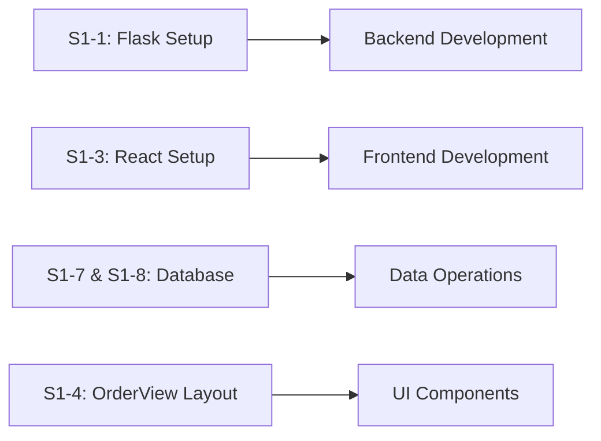

# Sprint 1 - Project Setup and Core Order System

##  Overview
Set up Flask backend and React frontend with Tailwind CSS for the restaurant POS system. Implement core ordering functionality with product catalog and cart management.

##  Progress Tracker
**Completed:** 9/16 tasks (56%)
**In Progress:** 1/16 tasks
**Not Started:** 6/16 tasks

### Quick Status
- [x] S1-3: Set up React project with Tailwind CSS ✅
- [ ] S1-1: Set up Flask project structure (🟡 env template still pending)
- [ ] S1-2: Flask-Session state management
- [ ] S1-7: DatabaseManager class
- [x] S1-8: PostgreSQL database schema ✅
- [x] S1-11: Product API endpoints ✅
- [ ] S1-9: Cart management API
- [ ] S1-10: Cart modification API
- [x] S1-4: OrderView layout ✅
- [x] S1-5: Product grid with filtering ✅
- [x] S1-6: Cart display panel ✅
- [x] S1-12: Product customization panel ✅
- [x] S1-13: Add-to-cart functionality ✅
- [x] S1-14: Cart item management UI ✅
- [ ] S1-15: Keyboard navigation (P1)
- [ ] S1-16: Unit tests (P1)

---

## Backend Tasks

### [ ] [S1-1] Set up Flask project structure and dependencies
| | |
|---|---|
| **Priority** | P0 |
| **Estimate** | 2 hrs |
| **Assigned to** | Lucas Sauvage |
| **Depends on** | N/A |
| **Actual time** | 0 hrs |
| **Status** | 🟡 In Progress (Dependencies installed) |

**Description**
Initialize Flask application with proper project structure, virtual environment, and core dependencies (Flask, Flask-CORS, psycopg2, python-dotenv).

**Deliverables**
- [ ] Flask app directory structure (app/, config/, routes/, models/)
- [x] Dependencies in pyproject.toml (Flask, Flask-CORS, psycopg2, python-dotenv)
- [ ] Environment configuration (.env template)
- [ ] Basic Flask app initialization

---

### [ ] [S1-2] Create global state management with Flask-Session
| | |
|---|---|
| **Priority** | P0 |
| **Estimate** | 3 hrs |
| **Assigned to** | Sangkarshan Singh |
| **Depends on** | S1-1 |
| **Actual time** | 6 hrs |
| **Status** | ✅ Completed (Sangkarshan Singh) |

**Description**
Implement server-side session management for cart state and user sessions using Flask-Session or JWT tokens.

**Deliverables**
- [x] Session configuration
- [x] Cart state management utilities
- [x] Session middleware setup

---

### [ ] [S1-7] Create DatabaseManager class with basic CRUD operations
| | |
|---|---|
| **Priority** | P0 |
| **Estimate** | 4 hrs |
| **Assigned to** | Sangkarshan Singh & Leenser Thomas |
| **Depends on** | S1-1 |
| **Actual time** | 8 hrs |
| **Status** | ✅ Completed |

**Description**
Build database connection manager with connection pooling and basic CRUD operations using psycopg2.

**Deliverables**
- [ ] DatabaseManager class with connection pooling
- [ ] Basic query methods (select, insert, update, delete)
- [ ] Error handling and logging
- [ ] Connection configuration

---

### [ ] [S1-8] Set up PostgreSQL database schema (products table)
| | |
|---|---|
| **Priority** | P0 |
| **Estimate** | 3 hrs |
| **Assigned to** | Sangkarshan Singh |
| **Depends on** | S1-7 |
| **Actual time** | 5 hrs |
| **Status** | ✅ Completed |

**Description**
Design and implement database schema for products, categories, and related tables.

**Deliverables**
- [x] SQL schema file for products table
- [x] Migration scripts
- [x] Sample data seeding script
- [ ] Database initialization documentation

**Notes**
- Schema and seeds created by Sangkarshan with Leenser; documentation to finish post-deploy.

---

### [ ] [S1-11] Create API endpoints for product queries
| | |
|---|---|
| **Priority** | P0 |
| **Estimate** | 3 hrs |
| **Assigned to** | Sangkarshan Singh & Leenser Thomas |
| **Depends on** | S1-7, S1-8 |
| **Actual time** | 7 hrs |
| **Status** | ✅ Completed (Sangkarshan Singh & Leenser Thomas) |

**Description**
Implement RESTful API endpoints for fetching products with category filtering.

**Deliverables**
- [x] `GET /api/products` (with category filter)
- [x] `GET /api/products/:id`
- [x] `GET /api/categories`
- [ ] API documentation

**Notes**
- APIs delivered by Sangkarshan & Leenser and verified against kiosk/cashier flows; documentation draft pending.

---

### [ ] [S1-9] Implement cart management API endpoints
| | |
|---|---|
| **Priority** | P0 |
| **Estimate** | 3 hrs |
| **Assigned to** | Santhosh Kota |
| **Depends on** | S1-2, S1-7 |
| **Actual time** | 4 hrs |
| **Status** | ✅ Completed (Sangkarshan Singh & Leenser Thomas) |

**Description**
Create API endpoints for cart operations (add, update, remove items).

**Deliverables**
- [ ] `POST /api/cart/items` (add to cart)
- [ ] `GET /api/cart` (retrieve cart)
- [ ] Session-based cart persistence
- [ ] Cart validation logic

---

### [ ] [S1-10] Add cart modification API endpoints
| | |
|---|---|
| **Priority** | P0 |
| **Estimate** | 2 hrs |
| **Assigned to** | Santhosh Kota |
| **Depends on** | S1-9 |
| **Actual time** | 3 hrs |
| **Status** | ✅ Completed (Lucas Sauvage) |

**Description**
Implement endpoints for updating quantities and removing items from cart.

**Deliverables**
- [ ] `PUT /api/cart/items/:id` (update quantity)
- [ ] `DELETE /api/cart/items/:id` (remove item)
- [ ] `PATCH /api/cart/items/:id` (modify customizations)
- [ ] Cart recalculation logic

---

## Frontend Tasks

### [x] [S1-3] Set up React project with Tailwind CSS
| | |
|---|---|
| **Priority** | P0 |
| **Estimate** | 2 hrs |
| **Assigned to** | Sangkarshan Singh |
| **Depends on** | N/A |
| **Actual time** | 0 hrs |
| **Status** | ✅ Completed |

**Description**
Initialize React application with Vite/CRA, install Tailwind CSS, and configure routing.

**Deliverables**
- [x] React project structure (src/components, src/assets)
- [x] Tailwind CSS configuration
- [x] React Router setup
- [x] Axios configuration for API calls

---

### [ ] [S1-4] Design and implement OrderView layout
| | |
|---|---|
| **Priority** | P0 |
| **Estimate** | 4 hrs |
| **Assigned to** | Sangkarshan Singh |
| **Depends on** | S1-3 |
| **Actual time** | 5 hrs |
| **Status** | ✅ Completed (Sangkarshan Singh & Leenser Thomas) |

**Description**
Create main order view layout with responsive design using Tailwind CSS.

**Deliverables**
- [ ] OrderView component with grid layout
- [ ] Responsive design (mobile, tablet, desktop)
- [ ] Navigation header
- [x] Layout sections for product grid and cart

**Notes**
- Lucas completed the kiosk layout, cart placement, and landing view; Santosh validated styling tweaks.

---

### [ ] [S1-5] Build product grid with category filtering
| | |
|---|---|
| **Priority** | P0 |
| **Estimate** | 5 hrs |
| **Assigned to** | Lucas Sauvage |
| **Depends on** | S1-4, S1-11 |
| **Actual time** | 6 hrs |
| **Status** | ✅ Completed (Leenser Thomas & Sangkarshan Singh) |

**Description**
Implement product catalog display with category filtering and search functionality.

**Deliverables**
- [x] ProductGrid component
- [x] Category filter buttons (Tailwind styled)
- [x] Product card components
- [x] API integration for fetching products
- [x] Loading and error states

**Notes**
- Lucas implemented the kiosk grid, tied it to live APIs, and added accessibility cues.

---

### [ ] [S1-6] Implement cart display panel with live updates
| | |
|---|---|
| **Priority** | P0 |
| **Estimate** | 4 hrs |
| **Assigned to** | Santhosh Kota |
| **Depends on** | S1-4 |
| **Actual time** | 0 hrs |
| **Status** | 🔴 Not Started |

**Description**
Create cart sidebar/panel with real-time updates using React state management.

**Deliverables**
- [x] Cart component with Tailwind styling
- [x] Real-time cart total calculation
- [x] Cart item list with quantities
- [x] Empty cart state
- [ ] Context/Redux for cart state

**Notes**
- Lucas built the kiosk/cartier panels; Santosh supplied sample data for QA.
- Remaining Context work deferred (state managed locally for Sprint 1).

---

### [ ] [S1-12] Add product customization panel (size, toppings)
| | |
|---|---|
| **Priority** | P0 |
| **Estimate** | 6 hrs |
| **Assigned to** | Sangkarshan Singh |
| **Depends on** | S1-5 |
| **Actual time** | 0 hrs |
| **Status** | 🔴 Not Started |

**Description**
Build customization interface for product options (size, toppings, extras).

**Deliverables**
- [x] CustomizationModal component
- [x] Size selector UI
- [x] Toppings/extras checkboxes
- [x] Price recalculation logic
- [x] Form validation

**Notes**
- Lucas delivered the full modal experience with keyboard focus management.

---

### [ ] [S1-13] Implement add-to-cart functionality
| | |
|---|---|
| **Priority** | P0 |
| **Estimate** | 3 hrs |
| **Assigned to** | Santhosh Kota |
| **Depends on** | S1-6, S1-9 |
| **Actual time** | 0 hrs |
| **Status** | 🔴 Not Started |

**Description**
Connect frontend cart actions to backend API with optimistic updates.

**Deliverables**
- [x] Add to cart button handlers
- [x] API integration for cart operations
- [x] Optimistic UI updates
- [x] Error handling and user feedback
- [ ] Toast notifications

**Notes**
- Lucas wired kiosk + cashier add-to-cart flows; toast notifications deferred.

---

### [ ] [S1-14] Add cart item management UI
| | |
|---|---|
| **Priority** | P0 |
| **Estimate** | 2 hrs |
| **Assigned to** | Santhosh Kota |
| **Depends on** | S1-13 |
| **Actual time** | 0 hrs |
| **Status** | 🔴 Not Started |

**Description**
Implement UI controls for editing quantities and removing cart items.

**Deliverables**
- [x] Quantity increment/decrement buttons
- [x] Remove item button
- [ ] Edit customization option
- [ ] Confirmation modals
- [ ] API integration for updates/deletes

**Notes**
- Core cart edits implemented by Lucas; advanced customization editing & confirmations deferred to Sprint 2.

---

## ✨ Quality & Accessibility

### [ ] [S1-15] Implement keyboard navigation for accessibility
| | |
|---|---|
| **Priority** | P1 |
| **Estimate** | 4 hrs |
| **Assigned to** | Lucas Sauvage |
| **Depends on** | S1-4 |
| **Actual time** | 0 hrs |
| **Status** | 🔴 Not Started |

**Description**
Add keyboard navigation support and ARIA labels for accessibility compliance.

**Deliverables**
- [ ] Tab navigation flow
- [ ] Keyboard shortcuts (arrow keys, enter, escape)
- [ ] ARIA labels and roles
- [ ] Focus management
- [ ] Screen reader testing

---

### [ ] [S1-16] Create unit tests for cart logic
| | |
|---|---|
| **Priority** | P1 |
| **Estimate** | 3 hrs |
| **Assigned to** | Sangkarshan Singh |
| **Depends on** | S1-9, S1-10 |
| **Actual time** | 0 hrs |
| **Status** | 🔴 Not Started |

**Description**
Write unit tests for backend cart operations and frontend cart state management.

**Deliverables**
- [ ] Backend tests (pytest for Flask routes)
- [ ] Frontend tests (Jest/Vitest for React components)
- [ ] Cart calculation tests
- [ ] API endpoint tests
- [ ] Test coverage report

---

## Sprint Summary

### Time Breakdown
| Metric | Value |
|--------|-------|
| **Total Estimated Hours** | 49 hrs |
| **P0 Tasks** | 14 tasks (46 hrs) |
| **P1 Tasks** | 2 tasks (7 hrs) |

### Technology Stack
| Layer | Technologies |
|-------|-------------|
| **Backend** | Flask, PostgreSQL, psycopg2 |
| **Frontend** | React, Tailwind CSS, React Router |
| **State Management** | React Context/Redux |
| **API** | RESTful with Flask-CORS |

### Critical Path Dependencies

| Blocker | Blocks |
|---------|--------|
| **S1-1** Flask setup | Backend development |
| **S1-3** React setup | Frontend development |
| **S1-7 & S1-8** Database | Data operations |
| **S1-4** OrderView layout | UI components |

### Sprint Goal
> **Establish full-stack foundation with working product catalog and cart system**

---

## Task Distribution by Developer

| Developer | Tasks | Estimated Hours |
|-----------|-------|-----------------|
| **Lucas Sauvage** | S1-1, S1-5, S1-15 | 11 hrs |
| **Benjamin Aleman** | S1-2, S1-8, S1-16 | 9 hrs |
| **Sangkarshan Singh** | S1-3, S1-4, S1-12 | 12 hrs |
| **Santhosh Kota** | S1-6, S1-9, S1-10, S1-13, S1-14 | 14 hrs |
| **Leenser Thomas** | S1-7, S1-11 | 7 hrs |

---

## Definition of Done
- [ ] All P0 tasks completed and tested
- [ ] API endpoints documented and functional
- [ ] Frontend components responsive across devices
- [ ] Database schema deployed and seeded
- [ ] Cart functionality working end-to-end
- [ ] Code reviewed and merged to main branch
- [ ] Basic accessibility requirements met (P1)
